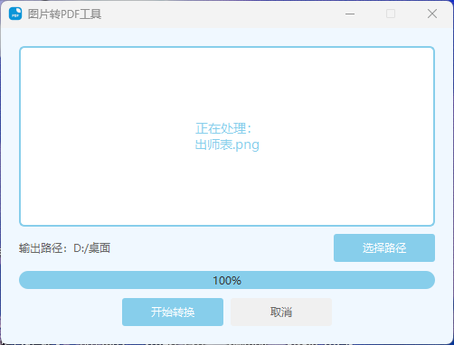
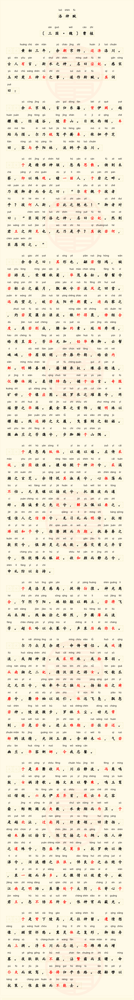
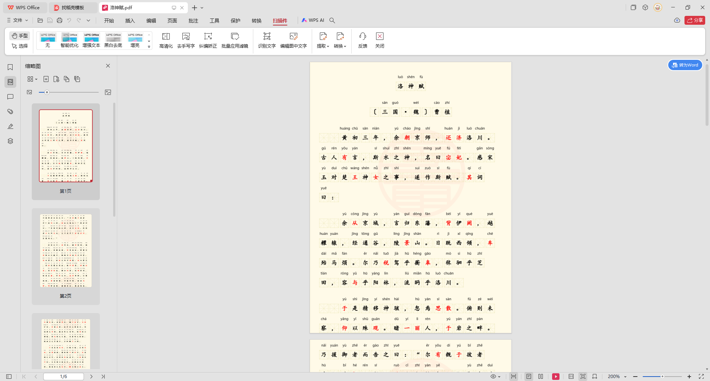

# 图片转PDF工具

[](#系统要求)
[](#系统要求)
[](#许可证)
[](https://github.com/gushuaialan1/png2pdf/releases)
[](https://github.com/gushuaialan1/png2pdf/commits/main)

一个简单易用的图片转PDF工具，专门针对带有拼音的教材或文档进行智能分割和转换。

## 更新日志

### 2025.12.15 - 表格智能分割
- 新增表格识别功能，勾选"内有表格"可避免表格被分割
- 基于 OpenCV 形态学+投影算法，精准识别表格区域
- 页面高度安全限制（≤110% A4），保证打印效果
- 智能分割策略：优先保证表格和标题的完整性

## 主要特性

- 智能识别文字区域，避免切断文字和拼音
- **表格智能分割，保证表格内容完整**
- 自动按照A4纸比例分割长图
- 支持黑色和红色文字的识别
- 支持批量转换多个图片文件
- 输出标准A4尺寸PDF，方便打印

## 使用说明

1. 启动程序
2. 将图片文件拖放到主窗口
3. 选择输出路径
4. 点击"开始转换"



## 智能分割效果

转换前 | 转换后
:-------------------------:|:-------------------------:
 | 

## 系统要求

- Windows 10 或更高版本
- Python 3.8 或更高版本

## 安装依赖

```bash
pip install -r requirements.txt
```

## 运行程序

```bash
python main.py
```

## 支持的图片格式

- PNG
- JPG/JPEG

## 注意事项

1. 输入图片需要清晰可辨
2. 建议使用扫描件或者清晰的拍照图片
3. 程序会自动处理文字颜色，支持黑色和红色文字
4. 输出的PDF文件将以原图片名称命名

## 技术特点

- 基于颜色识别的文字区域检测
- 智能空白区域分析
- A4比例自适应
- 多线程处理，支持取消操作

## 开发环境

- Python 3.8+
- PyQt6
- Pillow
- NumPy
- PyPDF2
- OpenCV-Python（表格识别）

## 许可证

MIT License

## 联系方式

如有问题或建议，欢迎提出 Issue。 
